  

  

## 🚀 About Me

  

 

  <table>
    <tr>
      <td align="center" width="50%">
        
      </td>
      <td align="center" width="50%">
        

          <h3>🏆 Key Highlights</h3>
          <ul>
            <li>💡 Love building <strong>Java applications</strong> that solve real-world problems</li>
            <li>🚀 <strong>2 Professional Internships</strong> completed</li>
            <li>🎯 Consistent problem solver with <strong>algorithmic expertise</strong></li>
            
 
          </ul>
        

      </td>
    </tr>
  </table>

---

## 🌟 Skills Matrix

  

---

## 🛠️ Tech Skills Tree

  
# 🌟 ARIVUSELVAM'S TECH UNIVERSE 🌟

```mermaid

graph TD
    A[🌟 ARIVUSELVAM'S TECH UNIVERSE 🌟]

    %% Main Branches
    A --> B[🧠 Problem Solving<br>100+ LeetCode]
    A --> C[📈 Data Structures & Algorithms<br>Core CS Skills]
    A --> D[⚙️ Backend Development]
    A --> E[📊 Data & Analytics]
    A --> F[🎨 Frontend & UI/UX]
    A --> H[🔧 Dev Tools]
    A --> T[☕ Java, Spring Boot]
    A --> U[🌱 Learning & Expanding Horizons]

    %% Sub-branches
    C --> B
    D --> T
    D --> G[🧩 APIs & Database Integration]

    F --> L[🎨 HTML]
    F --> K[💄 CSS]
    F --> M[🎪 UI/UX Design]

    E --> S[📈 Power BI]
    E --> N[📊 SQL & Data Cleaning]

    H --> R[🧭 Git/GitHub]
    H --> V[🧰 VS Code, Postman, etc.]

    %% Styles
    style A fill:#0f172a,stroke:#6366f1,stroke-width:4px,color:#ffffff
    style B fill:#1e293b,stroke:#22d3ee
    style C fill:#1e293b,stroke:#22d3ee
    style D fill:#1e293b,stroke:#f59e0b
    style E fill:#1e293b,stroke:#fbbf24
    style F fill:#334155,stroke:#38bdf8
    style G fill:#334155,stroke:#38bdf8
    style H fill:#334155,stroke:#a78bfa
    style K fill:#475569,stroke:#60a5fa
    style L fill:#475569,stroke:#60a5fa
    style M fill:#475569,stroke:#60a5fa
    style N fill:#475569,stroke:#34d399
    style R fill:#475569,stroke:#a78bfa
    style S fill:#475569,stroke:#fbbf24
    style T fill:#1e293b,stroke:#f43f5e
    style U fill:#1e293b,stroke:#84cc16
    style V fill:#475569,stroke:#a78bfa
```

## 📊 GitHub Stats & Activity

  

 

  <table>
    <tr>
      <td align="center">
        
      </td>
      <td align="center">
        
      </td>
    </tr>
  </table>

 

  

 

  

---

## 🎯 Featured Projects & Repositories

  

 

<!-- 🔹 Project 1 -->

  <table>
    <tr>
      <th colspan="2">🧮 Calculator</th>
    </tr>
    <tr>
      <td align="center" width="50%">
        
      </td>
      <td align="left" width="50%">
        <strong>Tech Stack:</strong> Java • AWT • Swing  
        <strong>Features:</strong> GUI-based calculator for basic arithmetic operations  
        <strong>Impact:</strong> Simple and intuitive app showcasing Java GUI development skills
      </td>
    </tr>
  </table>

 

<!-- 🔹 Project 2 -->

  <table>
    <tr>
      <th colspan="2">🎧 Spotify Streaming Insights Dashboard</th>
    </tr>
    <tr>
      <td align="left" width="50%">
        <strong>Tech Stack:</strong> Power BI • SQL • Data Visualization  
        <strong>Features:</strong> Streaming trends, artist performance, user engagement analysis  
        <strong>Impact:</strong> Enables data-driven decisions for music and marketing insights
      </td>
      <td align="center" width="50%">
        
      </td>
    </tr>
  </table>

 

<!-- 🔹 Project 3 -->

  <table>
    <tr>
      <th colspan="2">🏠 Airbnb Data Analytics Dashboard</th>
    </tr>
    <tr>
      <td align="center" width="50%">
        
      </td>
      <td align="left" width="50%">
        <strong>Tech Stack:</strong> Power BI • Excel • SQL  
        <strong>Features:</strong> Market insights, pricing analysis, host performance tracking  
        <strong>Impact:</strong> Helps optimize Airbnb listings and understand travel patterns
      </td>
    </tr>
  </table>

 

---

## 🏆 Achievements & Certifications

| 🎯 Achievement | 📝 Description |
|---------------|----------------|
| 🧩 **100+ LeetCode Problems** | Strengthened algorithmic and problem-solving skills |
| 🔥 **50-Day LeetCode Streak** | Consistent daily practice and improvement |

---

## 📈 Contribution Graph

  

 

  

---

## 🤝 Let's Connect!

---

  

  <h3>💫 "Code is like humor. When you have to explain it, it's bad." - Cory House</h3>

